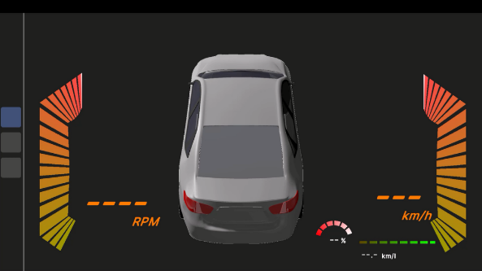
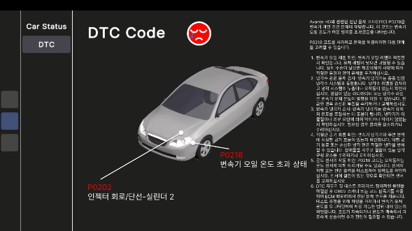
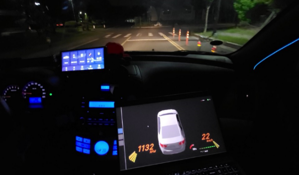

# HD_OBD2
## 프로젝트 설명

- 이 시스템은 OBD-II 인터페이스를 통해 자동차의 센서 및 제어 장치로부터 데이터를 획득한. GPT 모델을 사용하여 데이터를 해석하고, 자동차의 상태와 문제를 진단한다. 진단 결과와 해결 방법은 3D 시각화 기술을 활용하여 사용자에게 보여준다.
- 사용자는 개발된 시스템을 통해 자동차의 상태를 실시간으로 모니터링할 수 있다. 시스템은 자동차의 다양한 부품, 구조, 상태 등을 3D 그래픽으로 시각화 하여 화면에 표시한다. 또한, 시스템은 문제 진단 코드와 해당 코드에 대한 해결 방법을 제공한다.
  
## 개발 개요도

](images/development_overview.png)

## 개발 방법 및 활용 기술

(1) SW분야

 · 아두이노 라이브러리 설치와 OBD-II를 통한 데이터를 얻는 프로그램을 아두이노에 옮기기 위한 아두이노 IDE환경 설정 
 · 코드 정의 및 코드 탐색, 추가적인 Extentions을 활용하기 위해 Visual Studio Code에 아두이노 개발환경 설정 
 · CAN통신을 통해 OBD-II로부터 차량 데이터 정보(rpm,냉각수온도 등)를 받아오는 예제 코드를 활용하여 사용자가 필요로 하는 차량 데이터 정보를 요청하고 받아오는 프로그램 개발 
 · 차량에 문제가 생겼을 때 생성되는 DTC를 비트 마스크를 통해 5자리의 표준 진단코드로 바꿔주는 로직 개발 
 · 아두이노를 통해 얻은 차량 데이터와 5자리의 표준 진단코드를 시리얼 통신을 통해 Unity 3D에 전달 
 · 아두이노로 부터 전달 받은 차량 데이터를 Unity3D를 통해 시각적으로 보여주는 차량용 인포테인먼트 개발 
 · Blender3D를 통해 차량 3D 모델을 구현 
 · ChatGPT의 API를 통한 차량 문제 솔루션을 사용자에게 제공 

(2) HW분야

 · OBD-II 어댑터: OBD-II 어댑터는 자동차의 OBD-II 포트에 연결되어 자동차의 상태 및 진단 정보를 수집하는 역할을 수행한다. 이 어댑터를 거쳐 CAN 통신을 통해 데이터를 MCP2515로 전송한다. 
 · MCP2515: MCP2515는 CAN 컨트롤러로, OBD-II 어댑터와 통신하여 CAN 버스에서 자동차의 데이터를 읽고 쓸 수 있다. MCP2515을 활용하여 OBD-II 어댑터와 자동차 간의 CAN 통신을 처리한다. 
  · 아두이노: 아두이노는 마이크로컨트롤러 보드로, MCP2515와 연결하여 SPI 통신을 수행한다. MCP2515를 통해 OBD-II 어댑터로부터 수신한 데이터를 처리하고, Unity로 결과를 전송한다. 이후 데이터를 텍스트 형태로 가공하고 GPT 모델로 전송하여 자동차 문제에 대한 설명과 해결 방안을 생성한다. 
 · 라즈베리파이: 라즈베리파이를 메인 처리 장치로 활용하여 인포테인먼트 소프트웨어를 실행한다. 

 ## 작품 작동 원리 설명 
1. OBD-II 어댑터를 차량의 OBD-II 포트에 연결하여 CAN통신을 통해 차량의 데이터를 읽고 MCP2515와 통신
2. MCP2515는 OBD-II 어댑터와 통신하여 데이터를 검색하고 SPI 통신을 사용하여 Arduino 보드로 데이터 전송
3. Arduino 보드는 MCP2515로부터 데이터를 받아 필요한 데이터 처리 및 이진수로 표현된 문제 진단 코드를 표준 진단 코드로 변환
4. 차량에 문제 진단 코드 발생 시 관련 데이터로 상황에 맞는 역할을 수행하기 위해 GPT 모델을 통해 자동차 문제 및 솔루션 도출
5. GPT 모델에서 생성된 설명과 솔루션과 차량 데이터 정보를 받아 Unity 3D 환경에서 가공
6. 라즈베리파이를 메인 처리 장치로 활용하여 소프트웨어를 실행하고 실시간 데이터 저장 및 사용자와 상호 작용하여 전체 시스템 작동
7. 사용자는 차량의 특정 구성 요소 또는 영역을 선택하여 GPT 모델에서 생성된 설명 및 제안 솔루션과 함께 문제에 대한 자세한 정보 확인

## Images
1. Main UI 

2. DTC UI 

3. Actual Use 
 
